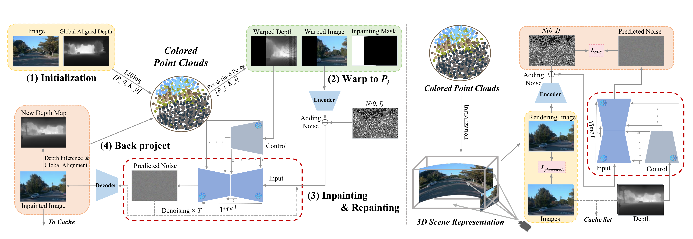

# StreetDreamer: High-Fidelity and Diverse Street Scene Generation

[](LICENSE)



## Introduction

**StreetDreamer** a pipeline facilitates the generation of infinite 3D autonomous driving scenes conditioned on a single image of a driving log sequence. Contrary to prior methodologies that learn to generate the distribution of 3D latent representations which are subse-quently decoded or rendered—approaches that incur significant computational expense—our method strategically divides the ill-posed problem of unbounded 3D street scene generation into two distinct phases: 3D-aware novel view generation and score-guided 3D reconstruction.

https://www.youtube.com/embed/VIDEO_ID

## Features
- [x] Realistic street scene generation
- [x] High diversity in generated environments
- [x] Integration with simulation platforms for autonomous driving
- [x] Customizable parameters for scene variations

## Installation

To install the dependencies and set up the project, please follow the instructions below:

```bash
# Clone the repository
git clone https://github.com/your-username/StreetDreamer.git
cd StreetDreamer

# Install required Python packages
pip install -r requirements.txt
```

We follow LucidDreamer and borrowed some of their code. Follow the instruction [here](https://github.com/luciddreamer-cvlab/LucidDreamer) to install the requirements of LucidDreamer

## Usage
Our Driving scene generation pipeline consists of two stages, tuning the ControlNet model and Scene Dreaming with a conditioning image.

For the first stage, we run the first script:
```bash
bash scripts/fine_tune_controlnet.sh
```
Remember to modify the parameters in this bash script, such as dataset directory and checkpointing directory.

Then we personalize our trained ControlNet model to a single sequence:
```bash
bash scripts/personalize-controlnet.sh
```

Still, don't forget to modify the data sequence directory and other parameters

After we get the personailzed checkpoints, we use them to generate scene with the following command:

```bash
bash scripts/dream.sh
```

## Dataset

We downloaded some sequences from Waymo-Open-Dataset to train the network. Follow the instruction below to download and pre-process the dataset

```bash
bash scripts/download_waymo.sh scripts/waymo_static_32.lst ./data/waymo_tfrecords/1.4.2
```

This will automatically make a folder that contains the dataset in `.tfrecord` format. However, our dataset needs to be pre-processed to train our model:

```bash
bash scipts/pre_process.sh
```
This should get all preprocessing steps done and the dataset should be ready for training


## Acknowledgement

We would like to thank [Haomo](haomo.ai) for their support during the development.
